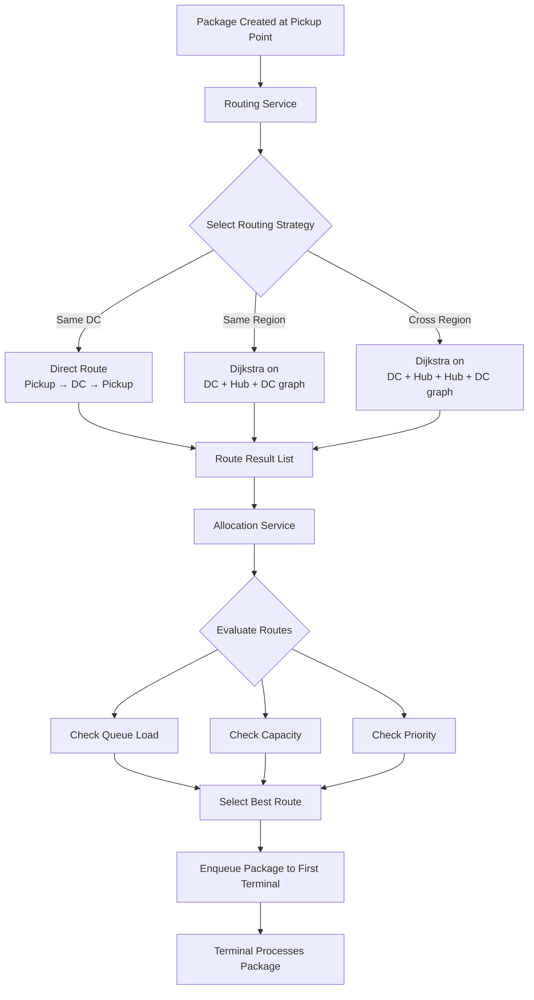
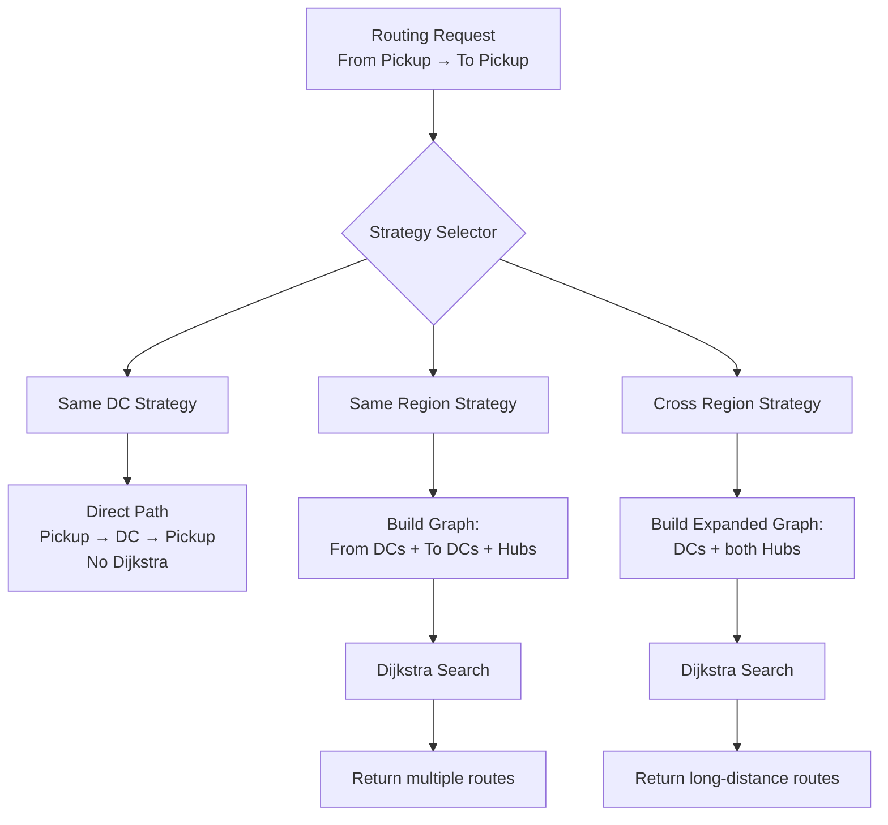
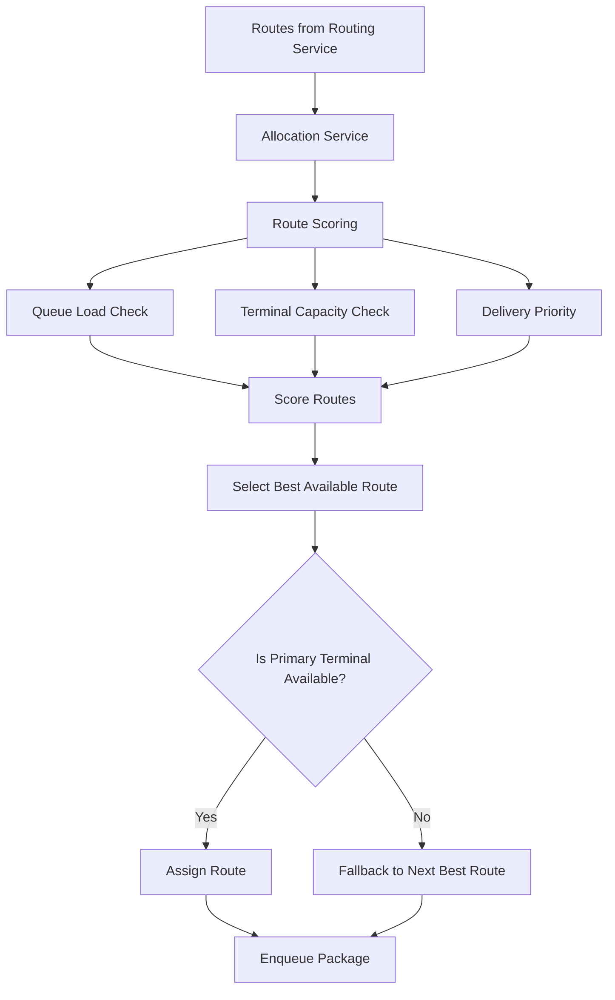

```mermaid
flowchart TD

A[Package Created at Pickup Point] --> B[Routing Service]

B --> C{Select Routing Strategy}

C -->|Same DC| D1[Direct Route<br>Pickup → DC → Pickup]

C -->|Same Region| D2[Dijkstra on<br>DC + Hub + DC graph]

C -->|Cross Region| D3[Dijkstra on<br>DC + Hub + Hub + DC graph]


D1 --> E[Route Result List]
D2 --> E
D3 --> E

E --> F[Allocation Service]

F --> G{Evaluate Routes}

G --> H1[Check Queue Load]
G --> H2[Check Capacity]
G --> H3[Check Priority]

H1 --> I[Select Best Route]
H2 --> I
H3 --> I

I --> J[Enqueue Package to First Terminal]

J --> K[Terminal Processes Package]
```

```mermaid
flowchart TD

A[Routing Request<br>From Pickup → To Pickup] --> B{Strategy Selector}

B --> C1[Same DC Strategy]
B --> C2[Same Region Strategy]
B --> C3[Cross Region Strategy]

C1 --> D1[Direct Path<br>Pickup → DC → Pickup<br>No Dijkstra]

C2 --> D2[Build Graph:<br>From DCs + To DCs + Hubs]
D2 --> D3[Dijkstra Search]
D3 --> D4[Return multiple routes]

C3 --> E1[Build Expanded Graph:<br>DCs + both Hubs]
E1 --> E2[Dijkstra Search]
E2 --> E3[Return long-distance routes]
```

```mermaid
flowchart TD

A[Routes from Routing Service] --> B[Allocation Service]

B --> C[Route Scoring]

C --> D1[Queue Load Check]
C --> D2[Terminal Capacity Check]
C --> D3[Delivery Priority]

D1 --> E[Score Routes]
D2 --> E
D3 --> E

E --> F[Select Best Available Route]

F --> G{Is Primary Terminal Available?}

G -->|Yes| H[Assign Route]
G -->|No| I[Fallback to Next Best Route]

H --> J[Enqueue Package]
I --> J
```